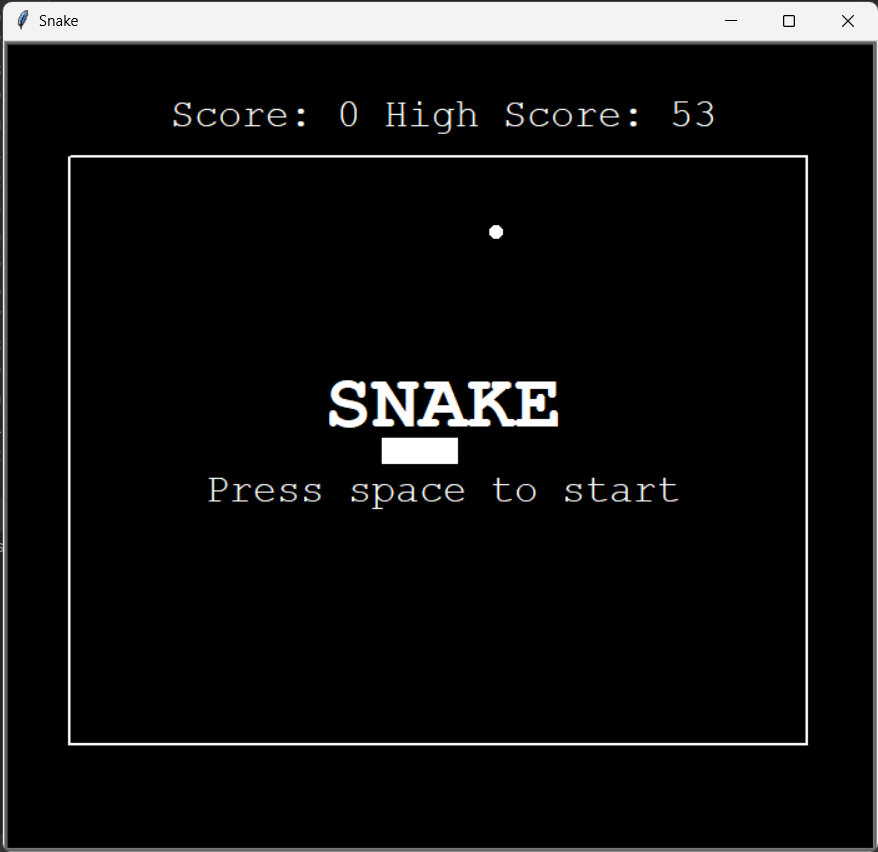
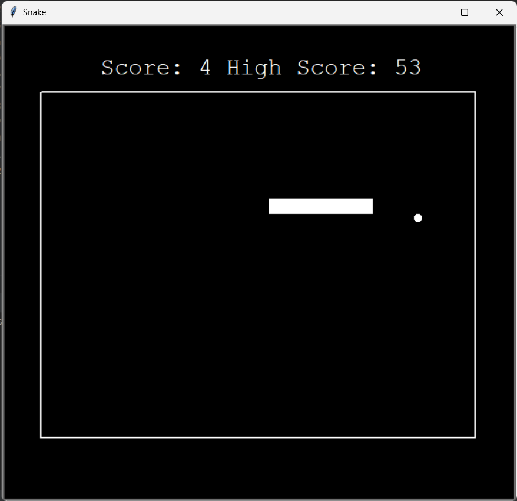

# Decription
Snake, the classic arcade game, implemented in Python using the Turtle graphics library

## Features
Snake Dynamics:
- The snake grows longer with each food item consumed, presenting a dynamic challenge for players as they strive to manage the snake's increasing length.

Food Placement:
- Colorful food items appear at random locations within the game space for the snake to consume, contributing to the snake's growth.

Responsive Controls:
- Players can control the snake's direction using arrow keys, guiding it through the game space to collect food.

Collision Detection:
- The game checks for collisions with the snake's own body or the game boundaries. A collision results in the end of the game.

Score Tracking:
- The score is dynamically updated as the snake consumes food, providing players with a clear indication of their progress.

## How to Play
Navigate the snake through the game space using arrow keys to collect food items. With each successful consumption, the snake grows longer, intensifying the challenge. Be cautious not to collide with the snake's own body or the game boundaries, as any collision brings the game to an end. Strive to achieve the highest score by skillfully guiding the snake through the evolving maze.

## Screenshots
- Main Menu

- Gameplay

